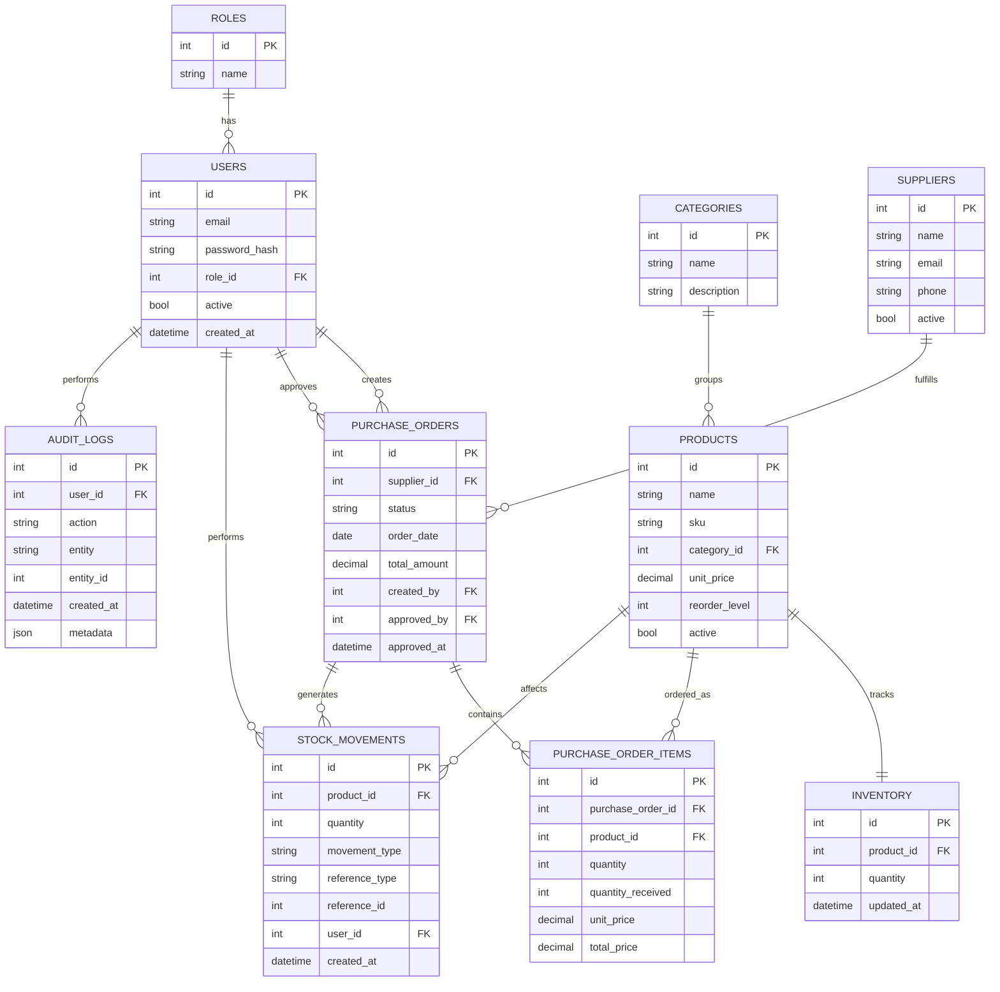

# Inventory & Procurement Management System
## Phase 0 — Requirements, Architecture & ER Design

---

## 1. Finalized Project Scope

A web-based **Inventory and Procurement Management System** for a small/medium business, covering the full lifecycle from supplier management through purchase ordering, approval, receiving, inventory tracking, and reporting — with role-based access control and a full audit trail.

**In scope (system-level):**
- Multi-role access (Admin, Procurement Manager, Warehouse Employee)
- Product & category catalog management
- Supplier management
- Purchase order lifecycle with enforced state machine
- Goods receiving with partial-receipt support
- Real-time inventory tracking with movement history
- Low-stock / out-of-stock detection
- Dashboard & reporting
- Audit logging of all sensitive actions

**Out of scope (system-level, see Section 14 for MVP cut list):** sales order management, multi-warehouse transfers, barcode scanning, external accounting integrations, notifications/email, multi-tenant support.

---

## 2. Actors and Use Cases

### Actors
| Actor | Description |
|---|---|
| Admin | Full system control, including user management |
| Procurement Manager | Owns the supplier & purchase order lifecycle |
| Warehouse Employee | Owns physical receiving and stock visibility |

### Use Cases by Actor

**Admin**
- Create/deactivate users, assign roles
- Full CRUD on products, categories, suppliers
- Create, approve, and receive purchase orders
- View inventory, stock movements, dashboards, audit logs

**Procurement Manager**
- View products (read-only)
- Full CRUD on suppliers
- Create, edit, submit, and approve purchase orders
- View inventory and low-stock alerts
- View procurement-focused reports

**Warehouse Employee**
- View products and inventory (read-only)
- Receive goods against approved purchase orders
- Record permitted stock movements (e.g., damage/adjustment, if explicitly granted)
- View purchase orders (read-only) and stock alerts

> Authorization for every use case above is enforced **server-side** via RBAC dependency checks on each endpoint — not just by hiding buttons in the UI. This is non-negotiable for a system with financial/inventory impact.

---

## 3. Functional Requirements

1. Users authenticate via email/password; system issues a session token (JWT).
2. Each user has exactly one role: Admin, Procurement Manager, or Warehouse Employee.
3. Admins manage products, categories, suppliers with full CRUD.
4. SKU must be unique across products; prices cannot be negative.
5. Procurement Managers/Admins create purchase orders referencing a supplier and line items.
6. Purchase orders move through a **strict, backend-validated state machine**.
7. Only Admins/Procurement Managers can approve purchase orders.
8. Warehouse Employees (or Admins) receive goods against **approved** purchase orders only.
9. Receiving cannot exceed the ordered quantity, ever — partial receiving is allowed and tracked.
10. Every inventory quantity change must be traceable to a `stock_movement` record.
11. Inventory quantity can never go negative.
12. Products below `reorder_level` are flagged `LOW_STOCK`; at zero, `OUT_OF_STOCK`.
13. All sensitive actions are recorded in an immutable audit log.
14. Dashboard reflects real, live aggregated data — never hardcoded.
15. Lists (products, suppliers, purchase orders, inventory) support search, filter, and pagination performed at the database level.

---

## 4. Non-Functional Requirements

| Category | Requirement |
|---|---|
| **Security** | Password hashing (bcrypt), JWT auth, RBAC enforced server-side, no secrets in code, parameterized queries via ORM (no raw SQL injection risk) |
| **Data Integrity** | All multi-step inventory operations wrapped in DB transactions with rollback on failure |
| **Consistency** | Backend is the single source of truth for totals, quantities, and state transitions — frontend values are never trusted |
| **Maintainability** | Layered architecture (API → Service → Repository → Model) with clear separation of concerns |
| **Testability** | Business logic isolated in service layer so it can be unit-tested without HTTP or DB mocking gymnastics |
| **Performance** | Indexed foreign keys and search columns (SKU, name, status); paginated queries, not full-table loads |
| **Portability** | Fully containerized with Docker Compose; runs identically on any machine |
| **Auditability** | Every state-changing action on core entities produces an audit record |
| **Usability** | Clean, responsive React UI with consistent loading/error/empty states |

---

## 5. Core Business Workflows

### 5.1 Procurement Workflow (primary)
```
Supplier
  → Purchase Order (DRAFT)
     → Purchase Order Items added
     → SUBMITTED (locked from further free-form edits)
     → APPROVED (by Procurement Manager/Admin)
     → Goods Received (partial or full)
         → Inventory increased per product
         → Stock Movement (PURCHASE) created per line
         → PO status becomes PARTIALLY_RECEIVED or RECEIVED
     → (or) CANCELLED at any pre-receiving stage
```

### 5.2 Stock Movement Workflow (generic)
Any inventory-affecting action (purchase receipt, manual adjustment, damage, return) must:
1. Validate the operation won't drive stock negative
2. Update `inventory.quantity`
3. Insert a `stock_movements` row referencing the cause
4. Insert an `audit_logs` row
5. Commit atomically — all or nothing

### 5.3 Low-Stock Detection Workflow
Computed, not stored redundantly as a "status flag" that can drift out of sync — evaluated at query time (or via a lightweight scheduled/query-time comparison of `quantity` vs `reorder_level`) so it's always accurate. (Discussed further in Phase 10.)

---

## 6. Database Entities

| Entity | Purpose |
|---|---|
| `users` | Login credentials, identity |
| `roles` | Defines Admin / Procurement Manager / Warehouse Employee |
| `categories` | Groups products |
| `products` | Catalog items |
| `suppliers` | Vendors goods are purchased from |
| `purchase_orders` | Header record of a procurement transaction |
| `purchase_order_items` | Line items of a PO |
| `inventory` | Current on-hand quantity per product |
| `stock_movements` | Immutable ledger of every inventory change |
| `audit_logs` | Immutable ledger of every sensitive action |

Future (not built now, but schema won't block them): `sales`, `sale_items`, `warehouses`, `notifications`.

---

## 7. Entity Relationships

- `roles` 1 → N `users` (each user has one role)
- `categories` 1 → N `products`
- `products` 1 → 1 `inventory` (one inventory row per product — simplifies MVP; multi-warehouse would change this to N inventory rows per product)
- `products` 1 → N `purchase_order_items`
- `products` 1 → N `stock_movements`
- `suppliers` 1 → N `purchase_orders`
- `purchase_orders` 1 → N `purchase_order_items`
- `purchase_orders` 1 → N `stock_movements` (via reference_type/reference_id)
- `users` 1 → N `purchase_orders` (as `created_by`)
- `users` 1 → N `purchase_orders` (as `approved_by`)
- `users` 1 → N `stock_movements` (who performed it)
- `users` 1 → N `audit_logs` (who performed it)

### Proposed ER Diagram



**Design note:** `purchase_order_items` includes a `quantity_received` column (not explicitly listed in your spec but necessary) — this is how Rule 3 (no over-receiving) gets enforced without re-scanning the entire stock_movements table on every receipt. I'll flag this kind of addition explicitly whenever it comes up, rather than silently changing your schema.

---

## 8. Important Business Rules (recap, backend-enforced)

1. **No negative stock** — enforced in the inventory service before any decrement commits.
2. **Every inventory change → a stock movement row.** No exceptions, no silent updates.
3. **Receiving can't exceed ordered quantity** — checked against `quantity_received` per line item.
4. **Strict PO state machine** — transitions validated in the service layer via an explicit allowed-transitions map, never via arbitrary status PATCH from the frontend.
5. **Low stock / out of stock** are derived states (quantity vs. reorder_level), not manually set flags.
6. **Backend recalculates all totals** — PO total_amount and line total_price are computed server-side from unit_price × quantity, never trusted from the request body.

---

## 9. API Module Plan

| Module | Base Path | Notes |
|---|---|---|
| Auth | `/auth` | login, current user |
| Users | `/users` | Admin-only |
| Categories | `/categories` | Admin CRUD |
| Products | `/products` | Admin CRUD, others read-only |
| Suppliers | `/suppliers` | Admin/Procurement CRUD |
| Purchase Orders | `/purchase-orders` | Full lifecycle incl. `/submit`, `/approve`, `/receive`, `/cancel` sub-actions |
| Inventory | `/inventory` | Read + `/low-stock` + `/{product_id}/movements` |
| Audit Logs | `/audit-logs` | Admin-only, read-only |

Each state-changing PO action is a distinct endpoint (`POST /purchase-orders/{id}/approve`, etc.) rather than a generic status PATCH — this makes authorization rules and business validation specific to each transition instead of one giant conditional block.

---

## 10. Backend Folder Architecture

```
backend/
  app/
    main.py                      # app factory, router registration only
    api/                         # HTTP layer — request/response only, no business logic
      auth.py
      users.py
      categories.py
      products.py
      suppliers.py
      purchases.py
      inventory.py
      audit_logs.py
    models/                      # SQLAlchemy ORM models = DB schema
      user.py
      role.py
      category.py
      product.py
      supplier.py
      purchase_order.py
      purchase_order_item.py
      inventory.py
      stock_movement.py
      audit_log.py
    schemas/                     # Pydantic request/response contracts
      auth.py
      user.py
      product.py
      supplier.py
      purchase_order.py
      inventory.py
    services/                    # Business logic — the "brain"
      auth_service.py
      user_service.py
      product_service.py
      supplier_service.py
      purchase_service.py
      inventory_service.py
      audit_service.py
    repositories/                # DB query logic, isolated from business rules
      user_repository.py
      product_repository.py
      supplier_repository.py
      purchase_repository.py
      inventory_repository.py
    core/
      config.py                  # env-based settings
      security.py                # hashing, JWT
    db/
      database.py                # engine/session setup
    dependencies/
      auth.py                    # get_current_user, role guards
  tests/
    test_auth.py
    test_products.py
    test_purchase_orders.py
    test_inventory.py
  alembic/                       # migrations (recommended addition — see note below)
  requirements.txt
  Dockerfile
```

**Note on Alembic:** your spec didn't list a migrations tool, but hand-managing schema changes against MySQL without one becomes painful and risky past Phase 2. I recommend **Alembic** (the standard SQLAlchemy migration tool) starting in Phase 2, and will explain it in Teaching Mode when we get there rather than silently assuming you know it.

---

## 11. Frontend Folder Architecture

```
frontend/
  src/
    api/                         # axios/fetch wrapper per module
      authApi.js
      productApi.js
      supplierApi.js
      purchaseOrderApi.js
      inventoryApi.js
    components/
      common/                    # Button, Modal, Table, Input, Select,
                                  # Pagination, LoadingState, ErrorState, ConfirmDialog
      layout/                    # Sidebar, Navbar, ProtectedRoute
    pages/
      Login.jsx
      Dashboard.jsx
      Products.jsx
      Categories.jsx
      Suppliers.jsx
      PurchaseOrders.jsx
      PurchaseOrderDetails.jsx
      Inventory.jsx
      StockMovements.jsx
      LowStock.jsx
      Users.jsx
      AuditLogs.jsx
    context/
      AuthContext.jsx            # holds JWT + current user + role
    hooks/
      useAuth.js
      usePagination.js
    utils/
      formatters.js
    App.jsx
    main.jsx
  package.json
  Dockerfile
```

---

## 12. MVP Features

- Auth (login, JWT, RBAC on backend)
- Categories & Products CRUD
- Suppliers CRUD
- Purchase Orders: create → submit → approve → receive (with partial receiving) → cancel
- Inventory view + stock movement ledger
- Low-stock / out-of-stock detection
- Audit log for all state-changing actions
- Dashboard with live aggregated metrics
- Search, filter, pagination on Products/Suppliers/POs/Inventory
- Dockerized backend + frontend + MySQL

## 13. Explicitly NOT in MVP

- Sales/sale_items module
- Multi-warehouse support (single implicit warehouse only)
- Notifications/email/SMS
- Barcode/QR scanning
- File/image uploads for products
- Advanced analytics or exportable PDF/Excel reports
- Multi-tenant / multi-company support
- Password reset via email (will use a simple admin-reset flow instead, if needed)

These are natural "Phase 20+" extensions and are structurally compatible with what we're building (e.g., `inventory` is already scoped per-product, which would extend to per-warehouse later).

---

## 14. Development Roadmap

Following your specified phase order (0–19), each phase will:
1. Explain what's being built and why
2. Surface any design trade-offs
3. List files touched
4. Note DB changes (with migration, once Alembic is introduced)
5. Implement
6. Give run/test commands
7. Provide pytest tests for business logic
8. Give manual verification steps (e.g., curl/Postman flows or UI clicks)

No phase will begin without your explicit approval of the previous one.

---

## Open Questions Before Phase 1

1. **MySQL version** — do you have a preference (8.0 is the safe default), or should I just standardize on `mysql:8.0` in Docker?
2. **quantity_received column** — confirmed okay to add this to `purchase_order_items` as explained in Section 7?
3. Are you fine with **Alembic** being added as a migrations tool (Section 10 note), given it's a natural companion to SQLAlchemy rather than an unnecessary new technology?

Once you confirm the above (or tell me to just proceed with the recommended defaults), I'll move to **Phase 1: Project setup + database connection**.
